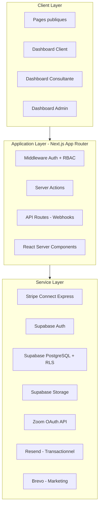
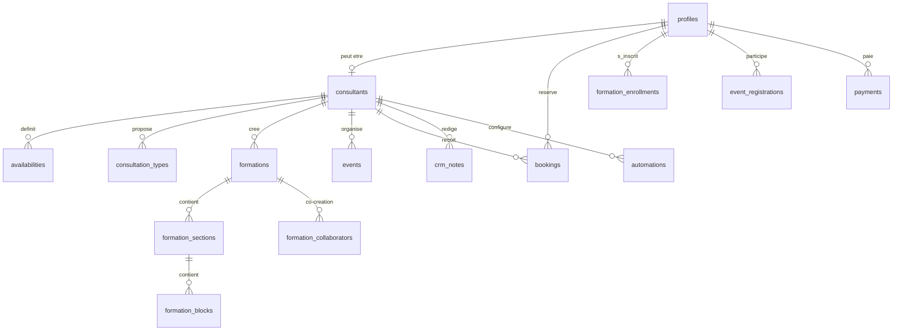

# Architecture Plateforme SaaS Multi-Consultantes Sante

## 1. Document de reference

Creer `/docs/PLATFORM_ARCHITECTURE.md` comme memoire persistante du projet. Toutes les decisions structurantes y seront documentees et versionees.

---

## 2. Architecture globale



---

## 3. Structure dossiers Next.js

```
/
├── docs/
│   └── PLATFORM_ARCHITECTURE.md
├── public/
│   ├── fonts/
│   └── images/
├── src/
│   ├── app/
│   │   ├── (auth)/
│   │   │   ├── connexion/page.tsx
│   │   │   ├── inscription/page.tsx
│   │   │   └── mot-de-passe-oublie/page.tsx
│   │   ├── (public)/
│   │   │   ├── page.tsx                    # Landing
│   │   │   ├── formations/[slug]/page.tsx
│   │   │   ├── consultantes/[slug]/page.tsx
│   │   │   └── evenements/[slug]/page.tsx
│   │   ├── (dashboard)/
│   │   │   ├── espace-client/
│   │   │   │   ├── page.tsx               # Overview
│   │   │   │   ├── formations/page.tsx
│   │   │   │   ├── reservations/page.tsx
│   │   │   │   └── profil/page.tsx
│   │   │   ├── espace-consultante/
│   │   │   │   ├── page.tsx               # Dashboard
│   │   │   │   ├── formations/
│   │   │   │   │   ├── page.tsx
│   │   │   │   │   ├── nouveau/page.tsx
│   │   │   │   │   └── [id]/edit/page.tsx
│   │   │   │   ├── reservations/page.tsx
│   │   │   │   ├── evenements/page.tsx
│   │   │   │   ├── crm/page.tsx
│   │   │   │   ├── emails/page.tsx
│   │   │   │   ├── automations/page.tsx
│   │   │   │   ├── analytics/page.tsx
│   │   │   │   └── parametres/page.tsx
│   │   │   └── admin/
│   │   │       ├── page.tsx
│   │   │       ├── consultantes/page.tsx
│   │   │       ├── formations/page.tsx
│   │   │       ├── paiements/page.tsx
│   │   │       ├── marketing/page.tsx
│   │   │       └── parametres/page.tsx
│   │   ├── api/
│   │   │   ├── webhooks/stripe/route.ts
│   │   │   ├── auth/callback/route.ts
│   │   │   ├── zoom/callback/route.ts
│   │   │   └── cron/route.ts
│   │   ├── layout.tsx
│   │   └── globals.css
│   ├── components/
│   │   ├── ui/                # Shadcn/ui
│   │   ├── layout/            # Header, Footer, Sidebar, Nav
│   │   ├── formations/        # FormationCard, BlockRenderer, etc.
│   │   ├── booking/           # Calendar, SlotPicker, etc.
│   │   ├── dashboard/         # StatCard, Charts, etc.
│   │   └── emails/            # TemplateEditor, CampaignBuilder
│   ├── lib/
│   │   ├── supabase/
│   │   │   ├── client.ts      # Browser client
│   │   │   ├── server.ts      # Server client (cookies)
│   │   │   ├── admin.ts       # Service role client
│   │   │   └── middleware.ts
│   │   ├── stripe/
│   │   │   ├── client.ts
│   │   │   ├── connect.ts     # Express account management
│   │   │   └── webhooks.ts    # Webhook handlers
│   │   ├── zoom/client.ts
│   │   ├── brevo/client.ts
│   │   ├── resend/client.ts
│   │   └── utils/
│   ├── hooks/                 # Custom React hooks
│   ├── stores/                # Zustand stores
│   ├── types/
│   │   ├── database.ts        # Supabase generated types
│   │   ├── stripe.ts
│   │   └── index.ts
│   ├── validations/           # Zod schemas
│   ├── constants/
│   │   ├── roles.ts
│   │   └── permissions.ts
│   ├── config/
│   │   ├── site.ts
│   │   └── navigation.ts
│   └── middleware.ts          # Next.js middleware (auth + RBAC)
├── supabase/
│   ├── migrations/            # SQL migrations
│   ├── seed.sql
│   └── config.toml
├── tailwind.config.ts         # Minimal (v4 uses CSS @theme)
├── next.config.ts
├── tsconfig.json
└── package.json
```

---

## 4. Schema base Supabase

### 4.1 Enums

- `user_role`: visitor, client, consultant, consultant_limited, marketing_manager, admin
- `booking_status`: pending, confirmed, cancelled, completed, no_show
- `formation_status`: draft, published, archived
- `block_type`: text, video, image, quiz, download
- `event_type`: online, in_person, hybrid
- `payment_status`: pending, succeeded, failed, refunded, partially_refunded
- `payment_type`: formation, booking, event

### 4.2 Tables principales

`**profiles**` (extends auth.users)

- id (PK, FK auth.users), role, email, first_name, last_name, phone, avatar_url, gdpr_consent_at, timestamps

`**consultants**`

- id (PK, FK profiles), slug (UNIQUE), bio, specialties (TEXT[]), stripe_account_id, stripe_account_status, commission_rate (DECIMAL, default 15.00), zoom tokens, is_active, onboarding_completed, timestamps

`**availabilities**` (recurring weekly schedule)

- id, consultant_id, day_of_week (0-6), start_time (TIME), end_time (TIME), is_active

`**availability_exceptions**` (holidays, time off)

- id, consultant_id, date, is_available, start_time, end_time, reason

`**consultation_types**`

- id, consultant_id, title, description, duration_minutes, price_cents, currency, is_online, buffer_minutes, is_active

`**bookings**`

- id, client_id, consultant_id, consultation_type_id, starts_at, ends_at, status, zoom_meeting_id, zoom_join_url, notes, cancellation_reason, cancelled_at, cancelled_by, stripe_payment_intent_id, refund_amount_cents, timestamps

`**formations**`

- id, consultant_id, title, slug (UNIQUE), description, short_description, thumbnail_url, price_cents, currency, status, published_at, timestamps

`**formation_collaborators**` (co-creation)

- formation_id, consultant_id, revenue_share (DECIMAL %)

`**formation_sections**`

- id, formation_id, title, position (INT)

`**formation_blocks**`

- id, section_id, type (block_type), content (JSONB), position (INT)

Content JSONB par type :

- text: `{ "html": "..." }`
- video: `{ "provider": "vimeo"|"youtube", "video_id": "...", "title": "..." }`
- image: `{ "url": "...", "alt": "...", "caption": "..." }`
- quiz: `{ "question": "...", "options": [{ "id", "text", "is_correct" }], "explanation": "..." }`
- download: `{ "url": "...", "filename": "...", "size_bytes": ... }`

`**formation_enrollments**`

- id, client_id, formation_id, stripe_payment_intent_id, enrolled_at, UNIQUE(client_id, formation_id)

`**formation_progress**`

- id, enrollment_id, block_id, completed, completed_at, UNIQUE(enrollment_id, block_id)

`**events**`

- id, consultant_id, title, slug, description, type, starts_at, ends_at, location, zoom_meeting_id, zoom_join_url, max_participants, price_cents, currency, is_published, timestamps

`**event_registrations**`

- id, event_id, client_id, stripe_payment_intent_id, status, registered_at, UNIQUE(event_id, client_id)

`**payments**` (source de verite paiements)

- id, stripe_payment_intent_id (UNIQUE), stripe_charge_id, client_id, consultant_id, amount_cents, platform_fee_cents, currency, type (payment_type), reference_id, status, refund_amount_cents, refunded_at, stripe_invoice_url, metadata (JSONB), timestamps

`**crm_notes**`

- id, client_id, consultant_id, content, timestamps

`**crm_tags**`

- id, name, color, consultant_id (NULL = global)

`**crm_contact_tags**`

- client_id, tag_id, consultant_id (PK composite)

`**email_templates**`

- id, name, subject, body_html, type (transactional/marketing), variables (JSONB), created_by, timestamps

`**email_campaigns**`

- id, consultant_id, name, template_id, subject, status, brevo_campaign_id, scheduled_at, sent_at, stats (JSONB)

`**automations**`

- id, consultant_id, name, trigger_type, trigger_config (JSONB), actions (JSONB array), is_active, timestamps

`**automation_logs**`

- id, automation_id, trigger_data, result, status, executed_at

`**audit_logs**` (monitoring)

- id, user_id, action, entity_type, entity_id, metadata (JSONB), ip_address, created_at

`**platform_settings**`

- key (PK), value (JSONB), updated_at

### 4.3 Relations cle



---

## 5. RLS Policies (strategie)

Principe : **deny by default**, chaque table a `ALTER TABLE ... ENABLE ROW LEVEL SECURITY`.

| Table                 | SELECT                                               | INSERT                | UPDATE                     | DELETE                  |
| --------------------- | ---------------------------------------------------- | --------------------- | -------------------------- | ----------------------- |
| profiles              | own + consultant(ses clients) + admin(all)           | trigger auth          | own only                   | admin only              |
| consultants           | public(actifs) + own + admin                         | admin                 | own + admin                | admin                   |
| bookings              | own(client) + own(consultant) + admin                | client(authenticated) | consultant(status) + admin | admin                   |
| formations            | public(published) + own(consultant) + collab + admin | consultant            | own + collab + admin       | own + admin             |
| formation_enrollments | own(client) + consultant(sa formation) + admin       | system(webhook)       | system                     | admin                   |
| crm_notes             | own(consultant) + admin                              | consultant            | own(consultant)            | own(consultant) + admin |
| payments              | own(client) + own(consultant) + admin                | system                | system                     | never                   |

Donnees clients partagees entre consultantes : une consultante voit le profil de base (nom, email) de tout client avec qui elle a au moins un booking ou enrollment. Les notes CRM restent privees par consultante.

---

## 6. Modele Stripe Connect

### Flow onboarding consultante

1. Consultante s'inscrit -> profil cree avec role `consultant`
2. Va dans Parametres -> "Connecter Stripe"
3. Appel `stripe.accounts.create({ type: 'express' })` -> obtention `account_id`
4. Redirect vers Stripe Connect Express onboarding
5. Webhook `account.updated` -> maj `stripe_account_status`

### Flow paiement

1. Client choisit formation/booking/event
2. Creation `Checkout Session` avec :

- `payment_intent_data.application_fee_amount` = montant x commission_rate / 100
- `payment_intent_data.transfer_data.destination` = stripe_account_id de la consultante

1. Client complete le paiement
2. Webhook `checkout.session.completed` -> fulfillment (grant access, confirm booking, register event)
3. Stripe transfere automatiquement les fonds moins la commission plateforme

### Co-creation formations

- Le paiement va au compte Stripe de la consultante principale
- La plateforme deduit sa commission
- Le split entre co-creatrices est gere via `stripe.transfers.create()` manuellement entre les comptes connectes
- Revenue shares stockes dans `formation_collaborators.revenue_share`

---

## 7. Webhooks Stripe

Endpoint unique : `/api/webhooks/stripe`

| Evenement                          | Action                                                   |
| ---------------------------------- | -------------------------------------------------------- |
| `checkout.session.completed`       | Creer enrollment / confirmer booking / enregistrer event |
| `payment_intent.succeeded`         | Mettre a jour `payments.status`                          |
| `charge.refunded`                  | Mettre a jour statut, montant rembourse                  |
| `account.updated`                  | Mettre a jour `consultants.stripe_account_status`        |
| `account.application.deauthorized` | Desactiver consultante                                   |

Securisation :

- Verification signature `stripe.webhooks.constructEvent()`
- Idempotency via `stripe_payment_intent_id` unique
- Retry logic cote Stripe (auto)
- Logging dans `audit_logs`

---

## 8. Gestion annulation & remboursements

```
handleCancellation(bookingId):
  booking = getBooking(bookingId)
  heuresAvant = diff(booking.starts_at, now()) en heures

  SI heuresAvant >= 48:
    -> Remboursement TOTAL via stripe.refunds.create(payment_intent)
    -> Booking status = 'cancelled'
  SINON:
    -> Remboursement 50% via stripe.refunds.create(payment_intent, amount: total/2)
    -> Booking status = 'cancelled'
    -> Note: la commission plateforme est recalculee proportionnellement

  -> Email confirmation annulation via Resend
  -> Trigger automation 'booking_cancelled'
  -> Audit log
```

Le remboursement Stripe reverse aussi proportionnellement l'`application_fee` sauf configuration contraire. Decision a prendre : la plateforme garde-t-elle sa commission sur la partie non remboursee ?

---

## 9. Gestion permissions (RBAC)

Fichier `src/constants/permissions.ts` definissant une matrice :

| Permission            | visitor | client | consultant | consultant_limited | marketing_manager | admin |
| --------------------- | ------- | ------ | ---------- | ------------------ | ----------------- | ----- |
| view_public_pages     | x       | x      | x          | x                  | x                 | x     |
| book_consultation     | -       | x      | -          | -                  | -                 | x     |
| buy_formation         | -       | x      | -          | -                  | -                 | x     |
| manage_own_formations | -       | -      | x          | x (read only)      | -                 | x     |
| manage_bookings       | -       | -      | x          | x                  | -                 | x     |
| manage_events         | -       | -      | x          | -                  | -                 | x     |
| access_crm            | -       | -      | x          | -                  | -                 | x     |
| manage_emails         | -       | -      | x          | -                  | x                 | x     |
| manage_automations    | -       | -      | x          | -                  | -                 | x     |
| view_analytics        | -       | -      | x          | x (limited)        | x (marketing)     | x     |
| manage_consultants    | -       | -      | -          | -                  | -                 | x     |
| manage_platform       | -       | -      | -          | -                  | -                 | x     |

Implementation via middleware Next.js + helper `hasPermission(role, permission)`.

---

## 10. Design Tokens & Tailwind v4

Dans `src/app/globals.css` :

```css
@import "tailwindcss";

@theme {
  --color-primary-red: #a0283e;
  --color-primary-red-light: #c4566a;
  --color-primary-red-dark: #7a1e2f;
  --color-primary-green: #203634;
  --color-primary-green-light: #2d4a47;
  --color-primary-green-dark: #162523;
  --color-background-beige: #fff8f6;
  --color-background-beige-dark: #f5ebe8;

  --font-family-serif: "Noto Serif", serif;
  --font-family-sans: "DM Sans", sans-serif;

  --radius-sm: 0.375rem;
  --radius-md: 0.5rem;
  --radius-lg: 0.75rem;
  --radius-xl: 1rem;
}
```

Usage : `text-primary-red`, `bg-background-beige`, `font-serif`, `font-sans`.

---

## 11. Strategie securite

- **Auth** : Supabase Auth (email/password + magic link) avec JWT custom claims pour le role
- **RBAC** : Middleware Next.js verifie role avant acces aux routes protegees
- **RLS** : Toutes les tables Supabase avec policies strictes
- **Validation** : Zod schemas sur toutes les entrees (Server Actions + API routes)
- **CSRF** : Next.js Server Actions gerent nativement les tokens CSRF
- **Rate Limiting** : Via Vercel Edge middleware ou `@upstash/ratelimit`
- **Headers** : CSP, HSTS, X-Frame-Options via `next.config.ts` headers
- **Secrets** : Variables env Vercel, jamais commitees
- **Webhooks** : Verification signature Stripe, idempotency keys
- **Upload** : Validation MIME type + taille max via Supabase Storage policies

---

## 12. Strategie migration Wix

| Phase             | Action                                                                        | Duree estimee |
| ----------------- | ----------------------------------------------------------------------------- | ------------- |
| 1. Audit          | Inventorier contenu Wix (pages, contacts, medias)                             | 1 semaine     |
| 2. Export         | Extraire donnees via Wix API / CSV export                                     | 1 semaine     |
| 3. Transform      | Scripts Node.js de transformation vers schema Supabase                        | 1-2 semaines  |
| 4. Import         | Insertion donnees dans Supabase + medias dans Storage                         | 1 semaine     |
| 5. Redirects      | Mapping anciennes URLs Wix -> nouvelles routes dans `next.config.ts` rewrites | 2 jours       |
| 6. Parallel run   | Les 2 sites coexistent, tests intensifs                                       | 2 semaines    |
| 7. DNS switch     | Pointer domaine vers Vercel                                                   | 1 jour        |
| 8. Post-migration | Monitoring, corrections, desactivation Wix                                    | 1 semaine     |

---

## 13. Roadmap MVP -> V2

### MVP (Phase 1 - 8-10 semaines)

- Setup projet (Next.js, Supabase, Stripe, Tailwind, Shadcn)
- Auth + roles (inscription, connexion, profils)
- Pages publiques (landing, liste formations, profils consultantes)
- CRUD formations (creation par consultante, blocs dynamiques)
- Systeme de booking (disponibilites, reservation, paiement)
- Stripe Connect onboarding + paiements
- Webhooks Stripe (fulfillment)
- Dashboard client (mes formations, mes RDV)
- Dashboard consultante (formations, RDV, revenus)
- Dashboard admin (vue globale, gestion consultantes)
- Emails transactionnels (Resend) : confirmation, rappels
- Politique d'annulation 48h
- RLS policies de base

### V1.5 (Phase 2 - 4-6 semaines)

- Evenements (creation, inscription, paiement)
- Zoom OAuth (creation auto meeting)
- CRM basique (notes, tags)
- Co-creation formations
- Analytics consultante (revenus, clients)

### V2 (Phase 3 - 6-8 semaines)

- Email marketing (Brevo integration)
- Systeme d'automations
- CRM avance (pipeline, historique interactions)
- Dashboard analytics avance (admin + consultante)
- Systeme de templates email
- Notifications in-app
- Export donnees RGPD

### V3 (Phase 4 - Futur)

- App mobile (React Native / Expo)
- API publique pour partenaires
- Systeme d'avis/reviews
- Programme de fidelite
- Multi-langue (i18next)
- Blog/contenu SEO integre

---

## 14. Monitoring & Logs

- **Sentry** : Error tracking frontend + server (source maps via Vercel integration)
- **Vercel Analytics** : Web Vitals, performance
- **Vercel Logs** : Serverless function logs avec retention
- `**audit_logs` table : Actions critiques (paiements, annulations, modifications roles, connexions)
- **Stripe Dashboard** : Monitoring paiements, disputes, webhooks
- **Uptime Robot** : Monitoring disponibilite (endpoint `/api/health`)
- **Supabase Dashboard** : Monitoring DB (queries lentes, connexions)
- **Cron job** (`/api/cron`) : Nettoyage logs anciens, rappels RDV, verification statuts

---

## 15. Plan RGPD

- **Consentement** : Banner cookie (stockage `gdpr_consent_at` dans `profiles`), consentement marketing explicite
- **Droit d'acces** : Endpoint `/api/user/data-export` generant un JSON/PDF de toutes les donnees
- **Droit a l'effacement** : Endpoint `/api/user/delete-account` avec suppression cascade (soft delete 30j puis hard delete)
- **Droit de rectification** : Edition profil standard
- **Portabilite** : Export au format JSON standard
- **Minimisation** : Ne collecter que les donnees necessaires
- **Retention** : Politique de retention (audit_logs: 2 ans, automation_logs: 6 mois)
- **DPA** : Contrat de sous-traitance avec chaque consultante
- **Politique de confidentialite** : Page `/politique-de-confidentialite`
- **DPO** : Contact designe dans les mentions legales
- **Breach notification** : Procedure documentee (72h CNIL)

---

## 16. Decisions architecturales cles a documenter

1. **Shared DB multi-tenant** : Une seule base Supabase, isolation par RLS (pas de schema par tenant)
2. **Server Actions > API Routes** : Privilegier les Server Actions Next.js pour les mutations, API routes uniquement pour webhooks et callbacks OAuth
3. **Payments as source of truth** : La table `payments` est la source de verite, synchronisee via webhooks Stripe
4. **JSONB pour les blocs** : Flexibilite maximale pour les types de contenu de formation
5. **Commission variable** : Stockee par consultante, appliquee via `application_fee_amount` Stripe
6. **CRM notes privees** : Les notes CRM d'une consultante ne sont JAMAIS visibles par une autre consultante
7. **Soft delete** : Les entites critiques (profils, formations, bookings) ne sont jamais supprimees physiquement en production
